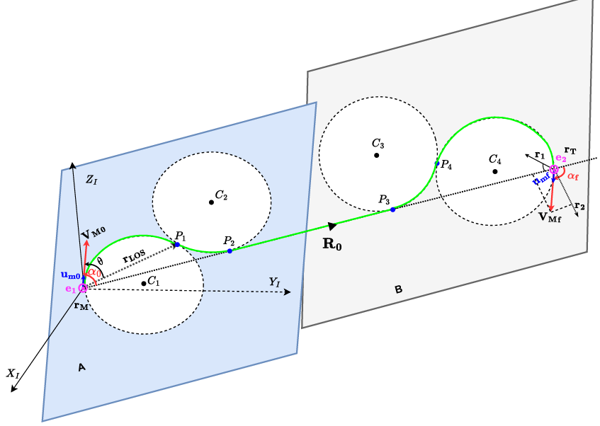

## Impact Angle Constrained 3D Guidance Law

This repository contains the implementation of the **Impact Angle Constrained 3D Guidance Law**, designed for precise interception of stationary targets and smooth waypoint tracking. The guidance law can be applied in various scenarios, including **UAV path following** and **missile-target interception**.

### Overview

The core of this method is built upon the classical **Proportional Navigation (PN) guidance law**, enhanced by incorporating **geometric constraints** to simplify and improve trajectory planning in 3D space. The trajectory is designed to remain **smooth and bounded** by inscribing **circular geometries**, which significantly reduces the complexity of traditional 3D guidance involving azimuth and elevation angles.

Instead of relying on spherical coordinates, this approach uses **Cartesian coordinates** and **vector algebra** to represent guidance states and constraints. The overall 3D path is modeled using two distinct **planes**, connected by the initial **Line of Sight (LOS)** vector.

### Impact Angle Representation

The **impact angle** is defined **relative to the initial LOS vector**. By appropriately selecting two planes, this relative angle can be accurately represented to reflect its true 3D definition.

* **Plane 1**:

  * Contains the **initial position vector** (`rM`), the **initial velocity vector** (`Vi`), and **Circles 1 & 2**.
  * The motion begins with **constant speed**, with `Vi` tangential to **Circle 1**.
  * **Circle 2** is constructed to be tangent to both the initial LOS (`R0`) and Circle 1.
  * The **plane normal** is obtained from the **cross product** of `Vi` and `R0`.

* **Plane 2**:

  * Contains **Circles 3 & 4** and the **final velocity vector** (`Vf`).
  * `Vf` is tangential to **Circle 4**, which lies at the terminal point of the trajectory.
  * **Circle 3** is constructed similarly to Circle 2, ensuring continuity.
  * The **plane normal** is derived from the **cross product** of `Vf` and `R0`.

### Waypoint Definition and Guidance Execution

The trajectory is constructed through a series of well-defined **waypoints**:

* **P1**: Contact point between **Circle 1** and **Circle 2**
* **P2**: Contact point between **Circle 2** and the **initial LOS vector (R0)**
* **P3**: Contact point between **Circle 3** and **R0**
* **P4**: Contact point between **Circle 3** and **Circle 4**

These waypoints ensure smooth transitions and geometrical consistency along the path. A **navigation ratio** of **N = 2** is used to maintain adherence to the circular trajectories, ensuring that the vehicle follows the desired path accurately.

By following this guidance law, the required **Line-of-Sight (LOS) rate** and corresponding **acceleration commands** can be generated to achieve interception with a **predefined impact angle**.

However, in real-world scenarios, practical limitations such as **wind gusts**, **drag**, **external disturbances**, and **sensor noise** may lead to deviations from the ideal path. To mitigate these effects and enhance robustness, the guidance law can be **augmented with control algorithms** such as:

* **PID (Proportional-Integral-Derivative) control**
* **LQR (Linear Quadratic Regulator)**
* **Robust control techniques**

These methods help maintain trajectory stability and accuracy under uncertain conditions.

The overall GNC loop can be designed as,

## GNC Loop architecture block
[ Guidance Law ] → [ Control System ] → [ Missile Dynamics ] → [ Sensors (noisy) ] → [ Navigation Estimator ]
                                 ↑                                                           |
                                 +---------------- Feedback ----------------------------------+
### Features

* 3D trajectory generation with **impact angle constraints**
* Smooth path transitions using **inscribed circular geometries**
* Applicable for **UAV guidance**, **autonomous navigation**, and **missile interception**
* Geometric and vector-based modeling for improved clarity and performance

